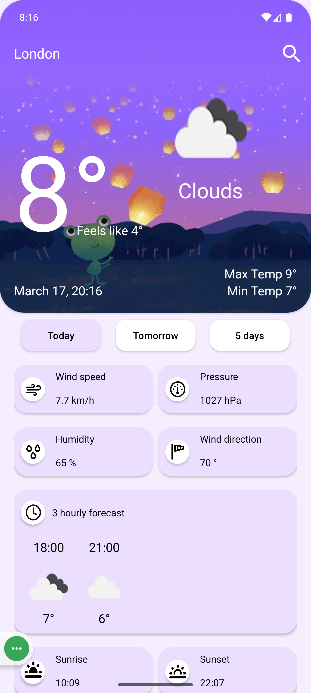
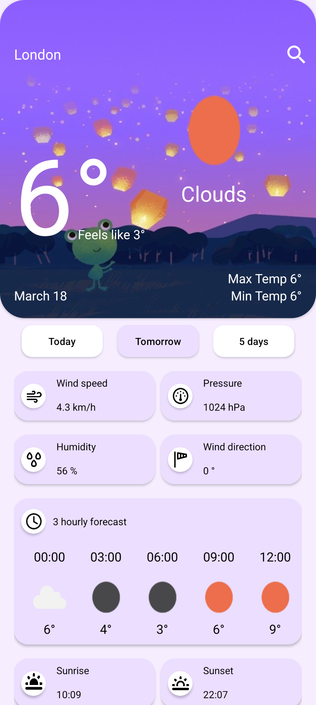
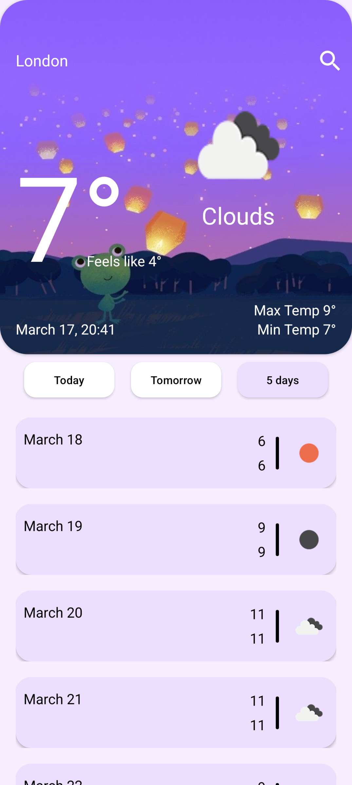
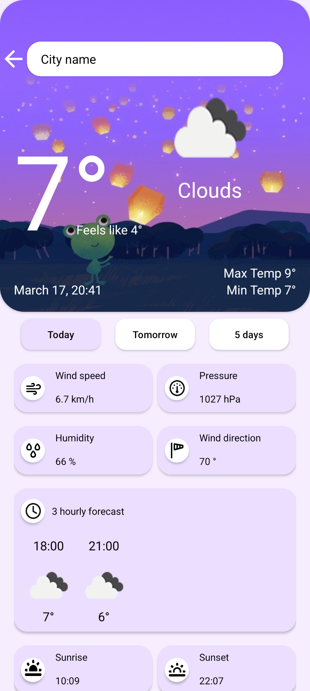

# 🌦️ WeatherApp

**WeatherApp** is a modern Kotlin-based Android application that displays real-time weather forecasts using the OpenWeatherMap API. It provides a clean and responsive interface to check today's, tomorrow's, and 5-day weather forecasts. The selected city is stored locally using `SharedPreferences`. No Room or local database is used in this project.

---

## 📸 Screenshots

| Today| Tomorrow | 5 Days | Change City |
|--------|--------|----------|------------|
|  |  |  |  |

---

## 📱 Key Screens & Features

- **Today Page** – See detailed weather info for the current day (temperature, condition, humidity, wind, etc.)
- **Tomorrow Page** – View the weather forecast for tomorrow
- **5 Days Page** – Get a 5-day forecast with daily breakdowns
- **City Search Page** – Enter and switch between cities
- **SharedPreferences** – Saves the selected city locally

---

## 🧠 Technologies Used

| Technology            | Purpose                                         |
|-----------------------|-------------------------------------------------|
| **Kotlin**            | Core programming language                       |
| **MVVM**              | Clean architecture pattern                      |
| **Retrofit**          | Fetch weather data from API                    |
| **Kotlin Coroutines** | Perform asynchronous operations                 |
| **StateFlow / LiveData** | Reactive UI updates                        |
| **SharedPreferences** | Store selected city locally                     |
| **Material Design**   | UI design components                            |
| **ViewBinding**       | Safe and easy view access                       |

---

## ✅ Core Features

- 🌍 Select and save any city
- 📡 Live weather data using OpenWeatherMap API
- 💾 Save city locally with SharedPreferences
- 🎯 Accurate weather for:
  - Today
  - Tomorrow
  - Next 5 days
- 🌈 Responsive and modern UI
- 🚫 No local database (Room is not used)

---

## 🧱 Project Architecture – MVVM

